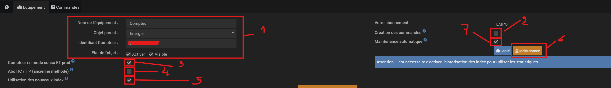

  

# Nouveautés de la version 4.9.3
  

# Option de maintenance automatique (nouvelle option dans chaque équipement):

# L'équipement 1/2:
 
<a href="../../images/teleinfo_equipement01.png">

<a>
  

## (7) Maintenance automatique
  

Si coché, sert à supprimer les informations superflues des commandes historisées (comme la commande '>_optimiser' ci-dessus). Cette maintenance automatique est prévue pour être exécutée tous les lundis à 00h25 mais cette programmation peut être modifiée dans le "moteur des tâches" de Jeedom.

L'action de cette maintenance dépend de:
- la commande est une des "STAT_YESTERDAY-***" : prend la valeur max de la journée et la recopie sur cette même journée à 00h 00mn 00s
- la commande est une des "STAT_TODAY-***" : prend la valeur max de l'heure' et la recopie sur cette même heure à 00mn 00s
- le mode de lissage a été paramétré sur "AVG" (moyenne): prend la valeur moyenne sur chaque intervalle horaire puis la replace à chaque heure à 00mn et 00s
- le mode de lissage n'est pas paramétré: prend le min de chaque heure et le remplace à chaque heure correspondante à 00mn 00s ET prend le max de la journée et le replace sur cette journée à 23h 59mn 59s
  
